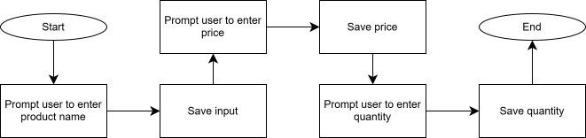
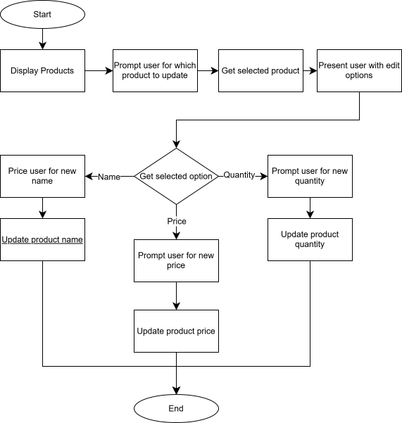
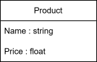
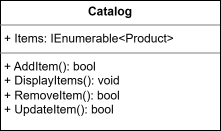
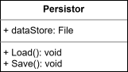

# Project Overview
------------
## Project Title
Project SIMS[^1] - Simple Inventory Management System

[^1]: No affiliation with the sims game series. The name is purely coincidental and chosen for its simplicity and relevance to the project's purpose.

------------------------
## Author(s)
[Alex Foreman](https://github.com/agforeman)

-------------------------

## Project Description
This project aims to deliver a simple inventory management system (SIMS) that allows users to add and remove products from the catalogue and manage inventory levels. User interaction will be handled via a command-line interface (CLI), providing a simple and straightforward way to interact with the system and manager inventory effectively without the need for a graphical user interface (GUI).

-------------------------

## Requirements
### Functional
- The system shall allow users to add products to the catalogue.
- The user shall be able to define products' names, prices, and stock quantities upon adding them to the catalogue.
- The system shall allow users to remove products from the catalogue.
- The system shall allow users to update inventory levels for products.
- The system shall allow users to view the product catalog and each product's details, including stock levels.
- When adding a product the system shall validate the product does not currently exist. If it does the system shall ask the user if they want to override the existing product. If yes, the system shall update the existing product with the new information. If no, the system shall cancel the add operation.

### Non-Functional
- The system shall allow at most 20 products in the catalogue.
- The system shall provide simple storage capabilities to persist product data between sessions.
- The system shall display error messages for invalid input and allow the user to retry the operation.

--------------------------

## Objectives
### Design
- System overview and functional flow defined by EOD 4/23.
- Code diagram drafts completed by EOD 4/23.
### Product Catalog
- Implementation of Product CRUD operations complete by 4/24.
- Product Catalog implementation complete by 4/24.

### Data Persistence
- Implementation of basic file-based storage for product data complete by 4/25.

### Testing and Bug Fixes
- User testing complete by 4/25.
- All defects documented and fixed by 4/25.

### Final Documentation
- All user flows diagrams updated, as needed, by 4/26.
- All class diagrams finalized and updated, as needed, by 4/26.

### Deliverables
- MVP delivered by 4/26.

---------------------------
## Design Outline
### Modules
- Product Management
- Catalog Management
- Data Persistence

### Diagrams
##### User Flows
###### System Overview
The following diagram shows the high level user flow of the program.

###### Add Product
The following diagram shows the high level user flow of the add program logic.

###### Update Product
The following diagram shows the high level user flow of the update product logic.

###### Remove Product
The following diagram shows the high level user flow for the remove product logic.

###### Display Catalogue
The following diagram shows the high level user flow for the display catalog logic.

#### Class Diagrams
##### Products

##### Catalogue

##### Persistor
